# 🏨 Hotel Management Information System (HMIS) API

A Hotel Management Information System REST API built with Laravel for managing hotel operations, including rooms, guests, reservations, check-in and check-out, billing, payments, and reporting.

The system follows a layered backend architecture with clear separation between HTTP handling, authorization, validation, business logic, persistence, data integrity, testing, documentation, CI/CD, and infrastructure.

---

## Contents

* [System Overview](#system-overview)
* [Architecture & Design Patterns](#architecture--design-patterns)
* [API & Business Workflows](#api--business-workflows)
* [Database & Data Integrity](#database--data-integrity)
* [Testing](#testing)
* [API Documentation](#api-documentation)
* [CI/CD & Git Workflow](#cicd--git-workflow)
* [Infrastructure & Containerization](#infrastructure--containerization)
* [Cloud & Deployment](#cloud--deployment)
* [Security](#security)
* [Technology Stack](#technology-stack)
* [Local Development](#local-development)
* [Visual Evidence](#visual-evidence)


---

<details>
<summary><strong>System Overview</strong></summary>

The HMIS API provides backend services for managing the complete hotel lifecycle.

### Core capabilities

* Authentication and authorization
* Hotel and room management
* Guest management
* Reservation management
* Room availability
* Check-in and check-out
* Billing and invoices
* Payment processing
* Operational reporting
* External payment integration
* Background processing
* Administrative workflows

### Engineering overview

**Laravel REST API · Layered Architecture · Repository & Service Patterns · MySQL · Automated Testing · Scribe · GitHub Actions · Docker · Redis · AWS**

</details>

---

<details>
<summary><strong>Architecture & Design Patterns</strong></summary>

The application follows a layered architecture with clearly defined responsibilities.

```text
Client
  ↓
Routes
  ↓
Middleware / Authentication
  ↓
Controller
  ↓
Form Request
  ↓
Policy / Authorization
  ↓
Service Layer
  ↓
Repository Interface
  ↓
Repository Implementation
  ↓
Eloquent Models
  ↓
MySQL
  ↓
API Resource
  ↓
HTTP Response
```

### Architecture responsibilities

| Layer                 | Responsibility                               |
| --------------------- | -------------------------------------------- |
| Routes                | Define API endpoints and middleware          |
| Controllers           | Coordinate HTTP requests and responses       |
| Form Requests         | Validate incoming request data               |
| Policies / Gates      | Enforce authorization                        |
| Services              | Execute application and business workflows   |
| Repository Interfaces | Define persistence contracts                 |
| Repositories          | Encapsulate database queries and persistence |
| Eloquent Models       | Represent domain data and relationships      |
| API Resources         | Transform data into controlled API responses |

### Repository Pattern

Persistence operations are exposed through repository interfaces rather than coupling business workflows directly to database implementations.

```text
ReservationInterface
        ↓
ReservationRepository
        ↓
Eloquent
        ↓
MySQL
```

This provides separation of concerns, dependency inversion, testability, and replaceable persistence implementations.

### Service Layer

Business workflows are handled by dedicated services rather than controllers.

Services coordinate:

* Repository operations
* Business rules
* Transactions
* Domain validation
* Calculations
* State changes
* External integrations

### Dependency Injection

Interfaces are bound to their concrete implementations through Laravel's service container, allowing services to depend on abstractions rather than concrete repository classes.

### Policies & Gates

Authorization is handled independently from business logic using Laravel Policies, Gates, and permissions.

### Form Requests

HTTP input validation is handled through dedicated Form Request classes.

### API Resources

Laravel API Resources provide a controlled transformation layer between Eloquent models and API responses.

</details>

---

<details>
<summary><strong>API & Business Workflows</strong></summary>

The API follows REST conventions and is versioned under:

```text
/api/v1
```

Resources use appropriate HTTP methods, status codes, validation responses, pagination, filtering, sorting, and consistent API response structures.

### Reservation workflow

```text
Request
  ↓
Validate Guest & Room
  ↓
Check Room Status
  ↓
Validate Occupancy
  ↓
Check Availability
  ↓
Calculate Nights
  ↓
Snapshot Nightly Rate
  ↓
Calculate Total
  ↓
Create Reservation
```

### Reservation consistency

Reservations use an interval-overlap rule to determine whether requested dates conflict with an existing reservation:

```text
existing_check_in < requested_check_out
AND
existing_check_out > requested_check_in
```

This permits consecutive stays while preventing overlapping reservations.

### Concurrent booking protection

Availability checks are protected by transactional database operations and appropriate locking around critical state changes.

This prevents two concurrent requests from successfully allocating the same room for overlapping dates.

### Reservation pricing

The room's current price is captured as the reservation's `nightly_rate` at booking time.

The reservation total is calculated from:

```text
number_of_nights × nightly_rate
```

This preserves the historical price agreed at the time of reservation.

### Idempotent operations

Critical write operations support idempotency where required.

Idempotency protection prevents repeated requests from producing duplicate business operations when caused by:

* Network failures
* Client retries
* Double-clicks
* Mobile connectivity issues
* External gateway retries
* Repeated callbacks

An idempotency key identifies a logical operation so that a retry can return the original result instead of executing the operation again.

### Billing workflow

```text
Reservation
    ↓
Invoice
    ↓
Invoice Items
    ↓
Payments
    ↓
Outstanding Balance
```

Invoices represent amounts owed while payments represent settlements against those invoices.

Multiple payments can be applied to the same invoice, allowing partial and full settlement.

### Payment consistency

Payment processing is treated as a transactional financial workflow.

Critical operations protect against:

* Duplicate payment requests
* Concurrent payment attempts
* Repeated provider callbacks
* Overpayment
* Duplicate transaction references
* Incorrect invoice balances
* Failed partial updates

Payment creation and invoice balance updates are kept within the same transaction boundary.

### External payment integration

The payment architecture supports integration with external payment providers, including Safaricom Daraja, while maintaining internal transaction consistency.

</details>

---

<details>
<summary><strong>Database & Data Integrity</strong></summary>

MySQL provides the primary relational database for the application.

Eloquent ORM is used for database interaction while critical integrity rules are reinforced at the database level.

### Database responsibilities

* Foreign-key constraints
* Unique constraints
* Indexes
* Referential integrity
* Transactional operations
* Restrictive delete behavior
* Consistent relationships
* Atomic state changes

### Core domain relationships

```text
Room Type
    ↓
Room
    ↓
Reservation
    ↓
Invoice
    ↓
Payment

Guest
    ↓
Reservation
```

### Transactional integrity

Critical multi-step operations are executed within database transactions where multiple records must remain consistent.

For example:

```text
Payment Created
      +
Invoice Balance Updated
      ↓
    COMMIT
```

If a critical operation fails, the transaction can be rolled back rather than leaving partially updated financial data.

### Concurrency control

Database locking is applied to critical records when necessary to protect against race conditions during concurrent operations.

### Database as final authority

Application validation provides user-friendly validation, while database constraints provide the final layer of protection against invalid states.

</details>

---

<details>
<summary><strong>Testing</strong></summary>

The application uses Pest/PHPUnit for automated testing.

Testing is divided into unit and feature/API testing.

### Unit Tests

Unit tests isolate individual application components and verify:

* Repository behavior
* Service logic
* Business calculations
* Domain rules
* Persistence-related behavior

### Feature Tests

Feature tests verify complete application behavior through the HTTP layer.

Coverage includes:

* Authentication
* Authorization
* CRUD operations
* Validation
* HTTP responses
* Database state
* Filtering
* Sorting
* Pagination
* Reservation workflows
* Reservation conflicts
* Billing
* Payments
* Business rules
* Concurrency-sensitive workflows

### Test execution

```bash
php artisan test
```

The same automated test suite is executed as part of the CI pipeline.

</details>

---

<details>
<summary><strong>API Documentation</strong></summary>

The API is documented using Scribe.

Documentation covers:

* Endpoints
* HTTP methods
* Parameters
* Request bodies
* Authentication
* Validation
* Response structures
* Example requests
* Example responses

The documentation provides a consistent reference for API consumers and developers.

</details>

---

<details>
<summary><strong>CI/CD & Git Workflow</strong></summary>

The project uses GitHub Actions for automated continuous integration.

### Development workflow

```text
Feature Branch
      ↓
Implementation
      ↓
Automated Tests
      ↓
Commit
      ↓
Push
      ↓
Pull Request
      ↓
GitHub Actions
      ↓
Review
      ↓
Merge
```

### CI pipeline

The CI environment:

* Installs PHP dependencies
* Configures the application environment
* Prepares the database
* Runs migrations
* Executes automated tests
* Verifies the application before merging changes

This ensures that changes are automatically validated before entering the main branch.

</details>

---

<details>
<summary><strong>Infrastructure & Containerization</strong></summary>

The application uses Docker to provide a consistent development and deployment environment.

### Containerized services

```text
┌───────────────────────────┐
│          Nginx             │
└─────────────┬─────────────┘
              ↓
┌───────────────────────────┐
│        PHP-FPM             │
│        Laravel             │
└─────────────┬─────────────┘
              ↓
      ┌───────┴────────┐
      ↓                ↓
   MySQL             Redis
                       ↓
                 Queue Workers
```

Docker isolates application and infrastructure services while providing reproducible environments.

Nginx handles incoming HTTP traffic and PHP-FPM executes the Laravel application.

Redis provides caching and queue infrastructure, while Laravel queue workers process asynchronous workloads.

</details>

---

<details>
<summary><strong>Cloud & Deployment</strong></summary>

The application is designed for deployment on AWS using managed and containerized infrastructure.

A production deployment can be structured around:

```text
Internet
    ↓
Load Balancer
    ↓
Application Containers
    ↓
Nginx / PHP-FPM
    ↓
Laravel
    ↓
RDS MySQL
    ↓
Redis
```

AWS infrastructure separates application execution from managed database and supporting infrastructure.

The deployment architecture supports:

* Application containers
* Load balancing
* Managed relational database
* Redis-backed caching
* Queue workers
* Environment-based configuration
* Secure secret management
* Horizontal application scaling

</details>

---

<details>
<summary><strong>Security</strong></summary>

Security controls are implemented across the application and infrastructure layers.

### Application security

* Laravel Sanctum authentication
* Policies and Gates
* Permission-based authorization
* Form Request validation
* Mass-assignment protection
* Password hashing
* Controlled query parameters
* Authorization boundaries

### Data security

* Database constraints
* Referential integrity
* Transactional operations
* Environment-based secrets
* Restricted production configuration

</details>

---

<details>
<summary><strong>Technology Stack</strong></summary>

| Category            | Technology                     |
| ------------------- | ------------------------------ |
| Backend             | PHP / Laravel                  |
| API                 | REST / Laravel API Resources   |
| Database            | MySQL / Eloquent ORM           |
| Authentication      | Laravel Sanctum                |
| Authorization       | Policies / Gates / Permissions |
| Validation          | Laravel Form Requests          |
| Querying            | Spatie Laravel Query Builder   |
| Testing             | Pest / PHPUnit                 |
| Documentation       | Scribe                         |
| Caching             | Redis                          |
| Queues              | Laravel Queues                 |
| Containers          | Docker / Docker Compose        |
| Web Server          | Nginx                          |
| Application Runtime | PHP-FPM                        |
| CI/CD               | GitHub Actions                 |
| Cloud               | AWS                            |
| Payments            | Safaricom Daraja               |
| AI Integration      | OpenAI                         |

</details>

---

<details>
<summary><strong>Local Development</strong></summary>

The project can be run locally using Laravel's development tooling and Docker-based infrastructure.

### Development workflow

```text
Develop
   ↓
Run Tests
   ↓
Commit
   ↓
Push Feature Branch
   ↓
Pull Request
   ↓
CI Verification
   ↓
Merge
```

</details>

# 👁️ Visual Evidence

The screenshots below provide visual evidence of the implemented API workflows, asynchronous processing, business rules, transactional workflows and end-to-end hotel operations.

<details>

<summary><strong>🔐 Authentication & Async Processing</strong></summary>

<table>
<tr>
<td align="center">
<strong>01 — User Registration</strong><br><br>
<a href="docs/screenshots/authentication/01-register-user.png">
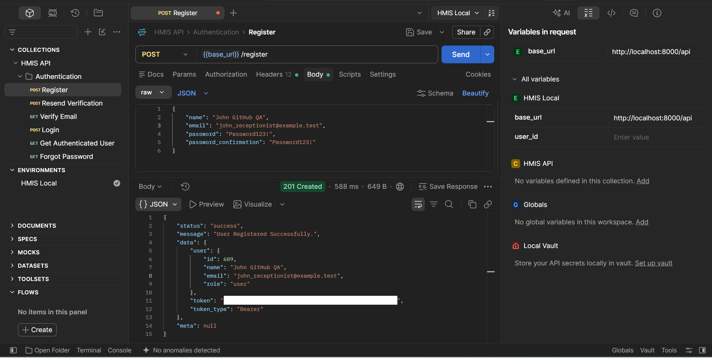
</a>
</td>

<td align="center">
<strong>02 — Email Verification Queued</strong><br><br>
<a href="docs/screenshots/authentication/02-email-verification-queue.png">
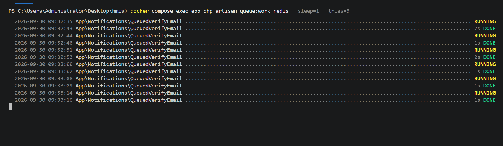
</a>
</td>

<td align="center">
<strong>03 — Verification Email</strong><br><br>
<a href="docs/screenshots/authentication/03-verification-email.png">
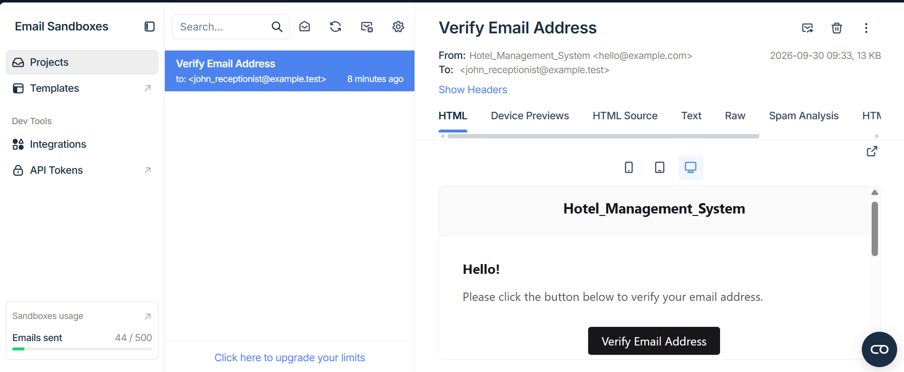
</a>
</td>
</tr>

<tr>
<td align="center">
<strong>04 — Verified Email</strong><br><br>
<a href="docs/screenshots/authentication/04-verified-email.png">
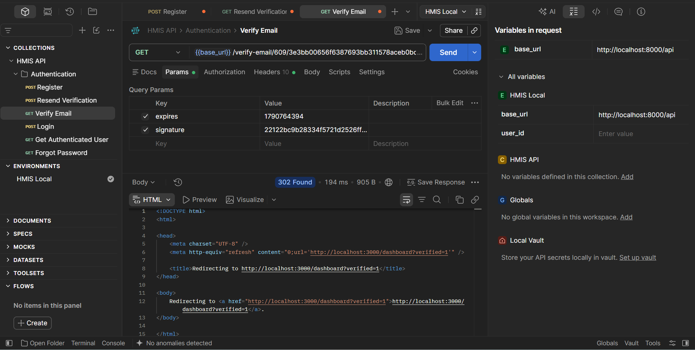
</a>
</td>

<td align="center">
<strong>05 — User Login</strong><br><br>
<a href="docs/screenshots/authentication/05-login-user.png">
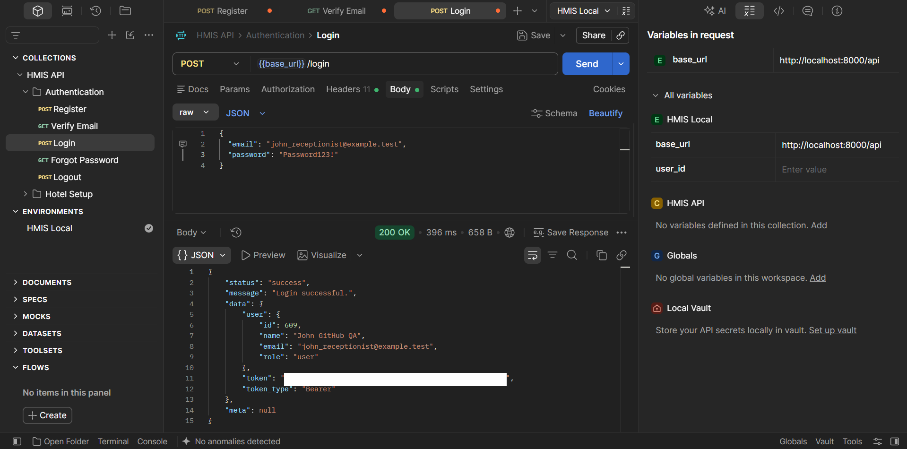
</a>
</td>

<td align="center">
<strong>06 — Logout</strong><br><br>
<a href="docs/screenshots/authentication/06-logout.png">
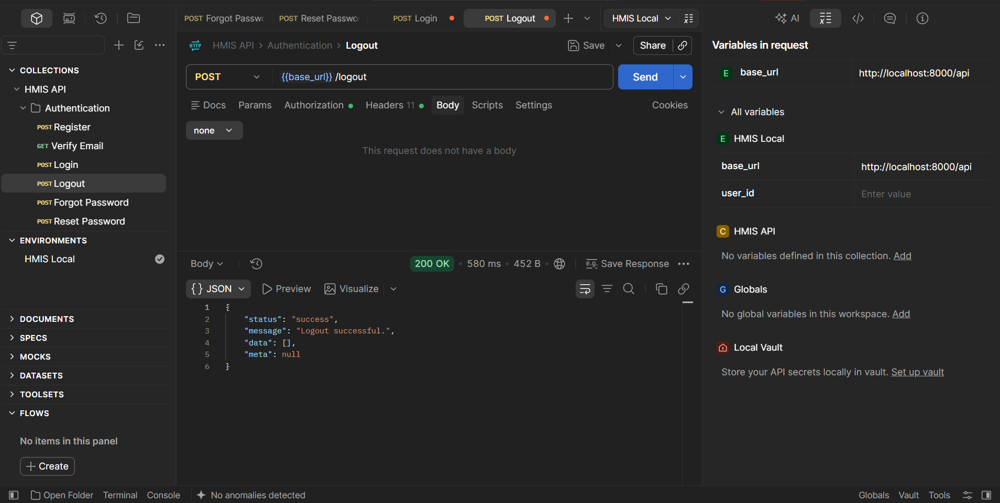
</a>
</td>
</tr>

<tr>
<td align="center">
<strong>07 — Password Reset Request</strong><br><br>
<a href="docs/screenshots/authentication/07-forgot-password.png">
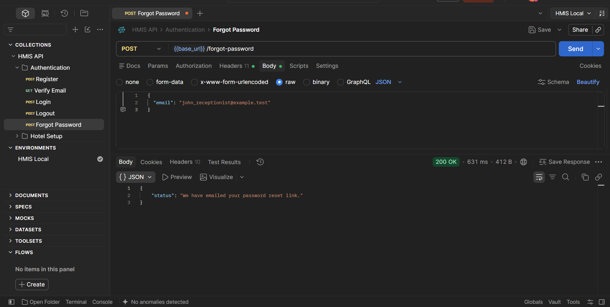
</a>
</td>

<td align="center">
<strong>08 — Password Reset Queued</strong><br><br>
<a href="docs/screenshots/authentication/08-queued-password-reset.png">
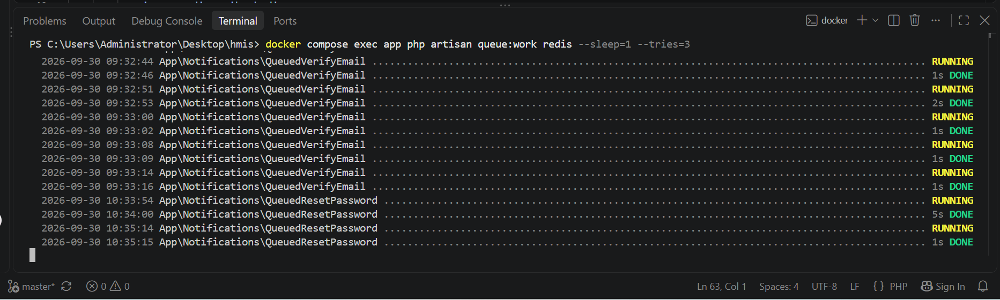
</a>
</td>

<td align="center">
<strong>09 — Password Reset Email</strong><br><br>
<a href="docs/screenshots/authentication/09-password-reset-email.png">
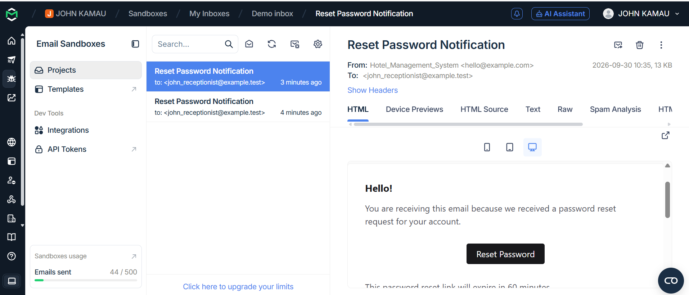
</a>
</td>
</tr>

<tr>
<td align="center">
<strong>10 — Password Reset</strong><br><br>
<a href="docs/screenshots/authentication/10-reset-password.png">
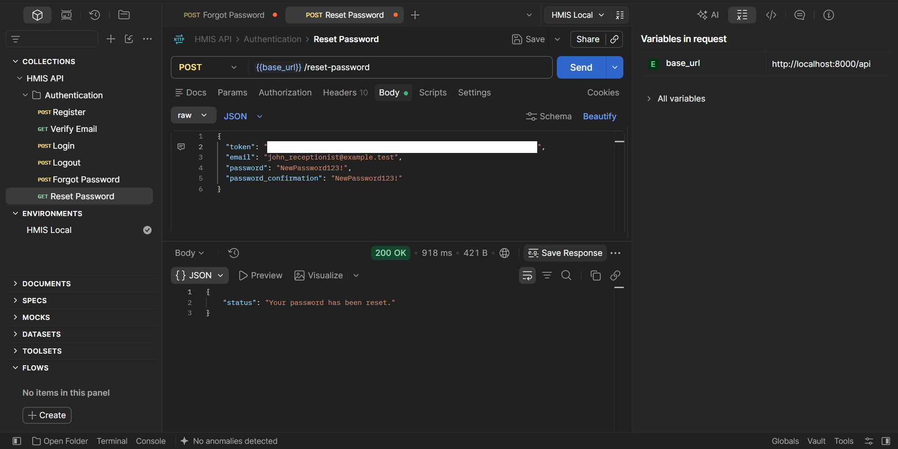
</a>
</td>

<td align="center">
<strong>11 — Old Password Rejected</strong><br><br>
<a href="docs/screenshots/authentication/11-failed-old-password.png">
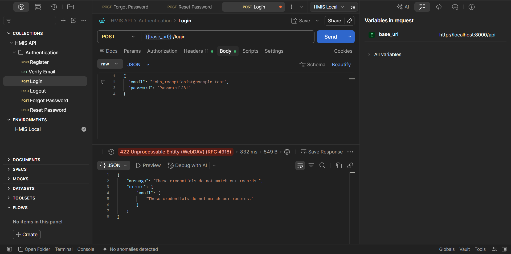
</a>
</td>

<td align="center">
<strong>12 — New Password Accepted</strong><br><br>
<a href="docs/screenshots/authentication/12-new-password-success.png">
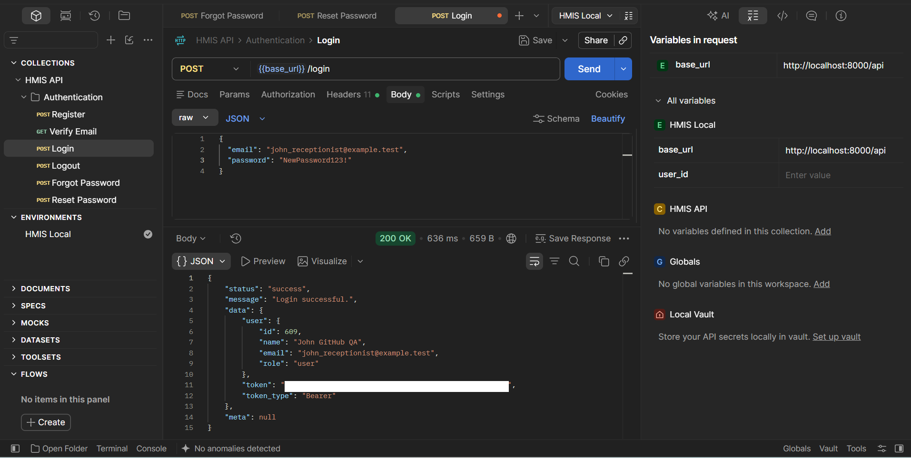
</a>
</td>
</tr>
</table>

</details>

<details>

<summary><strong>🏨 Hotel Setup & Resource Management</strong></summary>

### Room Types

<table>
<tr>
<td align="center">
<strong>Create Room Type</strong><br><br>
<a href="docs/screenshots/hotel-setup/Create Room Type API/01-create-room-type.png">

</a>
</td>

<td align="center">
<strong>Room Type With Image</strong><br><br>
<a href="docs/screenshots/hotel-setup/Create Room Type API/04-update-room-type-with-image-3.png">

</a>
</td>

<td align="center">
<strong>Primary Image</strong><br><br>
<a href="docs/screenshots/hotel-setup/Create Room Type API/09-verify-primary-room-type-image.png">

</a>
</td>
</tr>
</table>

### Rooms

<table>
<tr>
<td align="center">
<strong>Create Room</strong><br><br>
<a href="docs/screenshots/hotel-setup/Rooms/01-create-room.png">
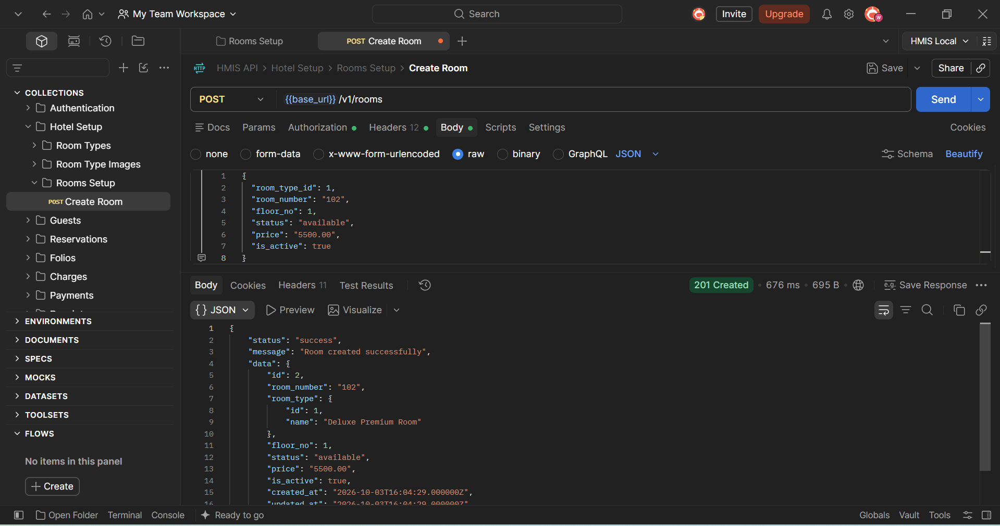
</a>
</td>

<td align="center">
<strong>List Rooms</strong><br><br>
<a href="docs/screenshots/hotel-setup/Rooms/02-list-rooms-1.png">
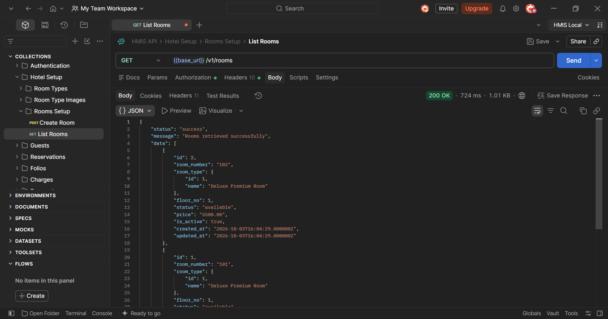
</a>
</td>

<td align="center">
<strong>Update Room</strong><br><br>
<a href="docs/screenshots/hotel-setup/Rooms/04-update-room.png">
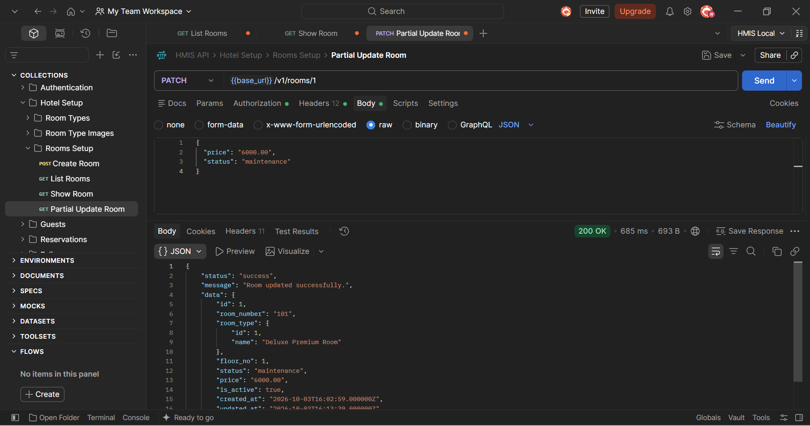
</a>
</td>
</tr>
</table>

</details>

<details>

<summary><strong>👤 Guest Management & Validation</strong></summary>

<table>
<tr>
<td align="center">
<strong>Create Guest</strong><br><br>
<a href="docs/screenshots/guests/01-create-guest.png">
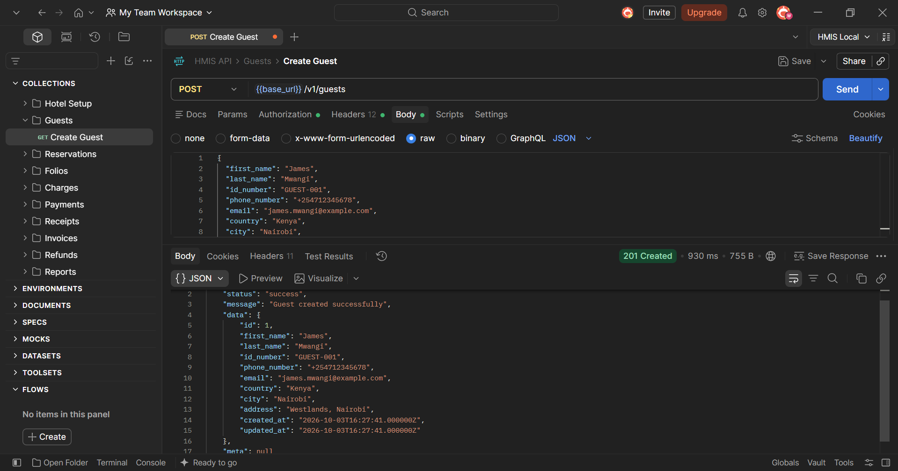
</a>
</td>

<td align="center">
<strong>List Guests</strong><br><br>
<a href="docs/screenshots/guests/02-list-guests.png">
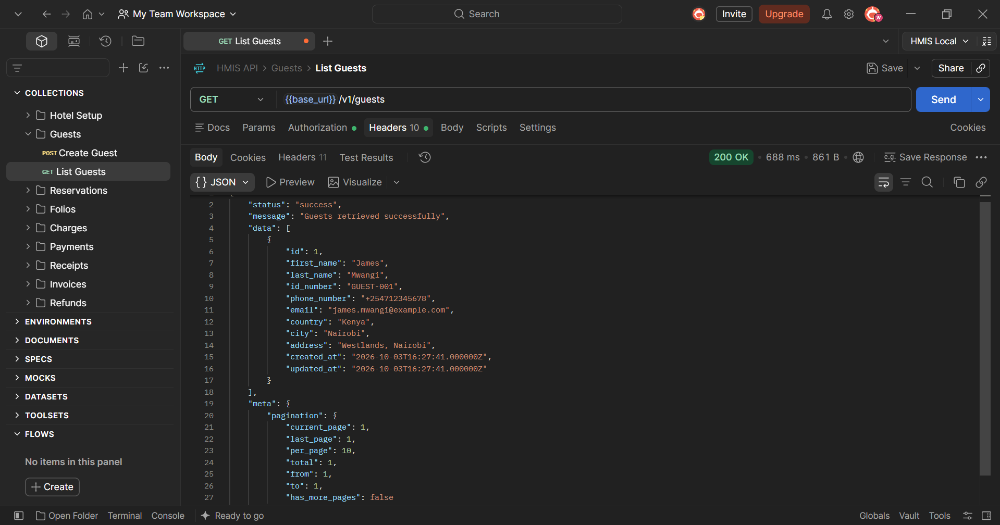
</a>
</td>

<td align="center">
<strong>Update Guest</strong><br><br>
<a href="docs/screenshots/guests/04-update-guest.png">
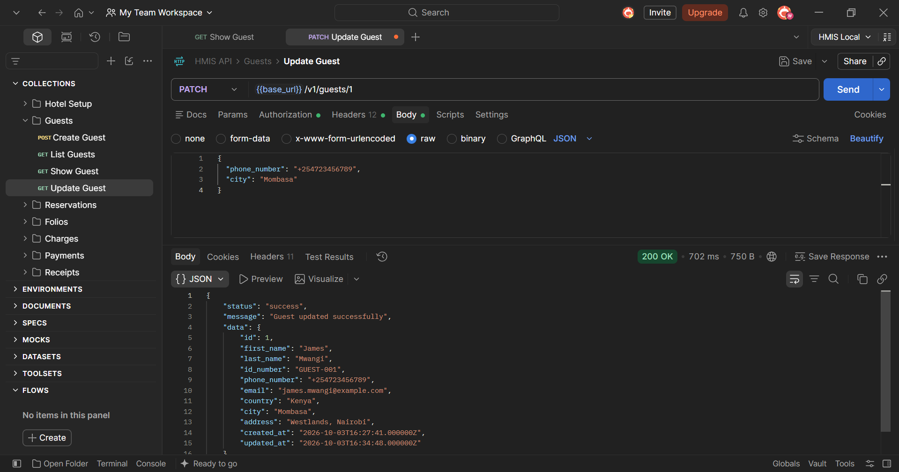
</a>
</td>
</tr>
</table>

</details>

<details>

<summary><strong>📅 Reservations & Room Availability</strong></summary>

<table>
<tr>
<td align="center">
<strong>Create Reservation</strong><br><br>
<a href="docs/screenshots/reservations/01-create-reservation-1.png">
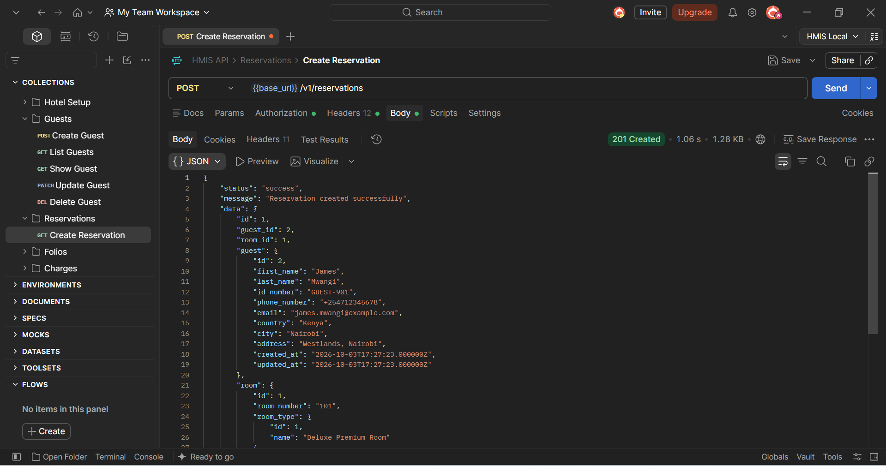
</a>
</td>

<td align="center">
<strong>Reservation Details</strong><br><br>
<a href="docs/screenshots/reservations/03-show-reservation-1.png">
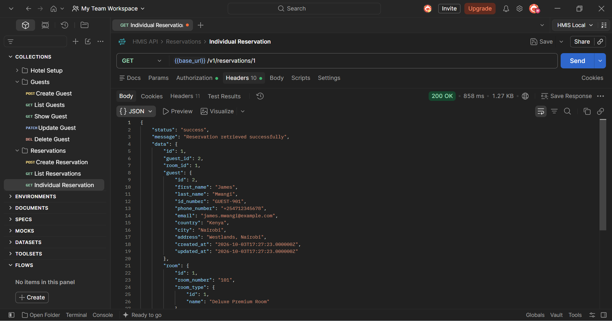
</a>
</td>

<td align="center">
<strong>Update Reservation</strong><br><br>
<a href="docs/screenshots/reservations/04-update-reservation-1.png">
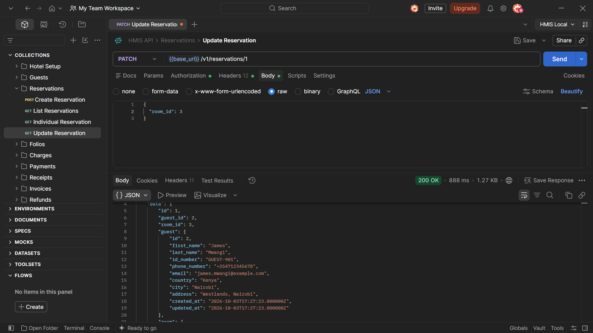
</a>
</td>
</tr>
</table>

</details>

<details>

<summary><strong>🔄 Operations & Transactional Workflows</strong></summary>

### 🚶 Walk-In Guest — End-to-End Operational Workflow

#### Guest Lifecycle & Automated Setup

<table>
<tr>
<td><strong>Create Walk-In Guest</strong><br></td>
<td><strong>Auto-Created Reservation</strong><br></td>
<td><strong>Auto-Created Folio</strong><br></td>
</tr>

<tr>
<td><strong>Room Occupied</strong><br></td>
<td><strong>Automatic Accommodation Charge</strong><br></td>
<td><strong>Folio Charges</strong><br></td>
</tr>
</table>

#### In-Stay Charges & Stay Extension

<table>
<tr>
<td><strong>Add Service Charge</strong><br></td>
<td><strong>Extend Stay</strong><br></td>
<td><strong>Updated Folio Charges</strong><br></td>
</tr>

<tr>
<td><strong>Folio Financial Summary</strong><br></td>
</tr>
</table>

#### Multi-Gateway Payments & Settlement

<table>
<tr>
<td><strong>Stripe Partial Payment</strong><br></td>
<td><strong>M-Pesa Partial Payment</strong><br></td>
<td><strong>Overpayment Protection</strong><br></td>
</tr>

<tr>
<td><strong>Final Payment</strong><br></td>
<td><strong>Payment Summary</strong><br></td>
</tr>
</table>

#### Folio Closure & Checkout

<table>
<tr>
<td><strong>Close Folio</strong><br></td>
<td><strong>Checkout Guest</strong><br></td>
<td><strong>Room Available</strong><br></td>
</tr>
</table>

### 🌐 Direct Reservation — Reservation-to-Check-In Workflow

<table>
<tr>
<td><strong>Create Reservation</strong><br></td>
<td><strong>Room Reserved</strong><br></td>
<td><strong>Check-In</strong><br></td>
</tr>

<tr>
<td><strong>Room Occupied</strong><br></td>
</tr>
</table>

</details>
